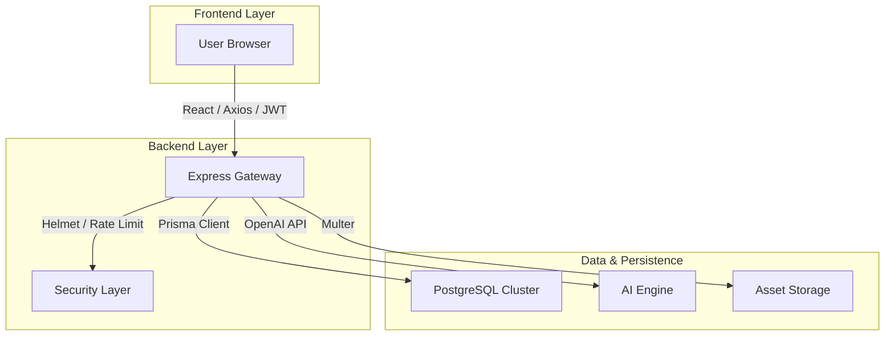

# Evangadi Forum: The Premium Community Engine 🚀

[](#)
[](https://opensource.org/licenses/MIT)
[](#)

A high-performance, professional-grade Q&A platform built for the modern web. Evangadi Forum combines enterprise-level security, AI-driven insights, and a sleek glassmorphic UI to provide a seamless knowledge-sharing experience.

---

## ✨ Key Pillars

### 🏛️ Engineering Excellence
- **PostgreSQL (Neon)**: Relational integrity with serverless scalability via Neon.
- **Prisma ORM**: Type-safe transactions, automated migrations, and schema-first development.
- **Optimistic UI**: Experience zero latency with instant feedback on likes, bookmarks, and votes.
- **Micro-animations**: Smooth, interactive transitions powered by modern CSS modules.

### 🎨 Design & Accessibility
- **Glassmorphism 2.0**: A premium, translucent UI with curated dark and light mode themes.
- **Responsiveness**: Pixel-perfect layout across mobile, tablet, and ultra-wide displays.
- **Skeleton Architecture**: Content placeholders to eliminate layout shift during loading.

### 🛡️ Security & Performance
- **Layered Security**: Integrated **Helmet.js** and **Express Rate Limiting** to prevent brute-force and common web attacks.
- **Environment Isolation**: Zero hardcoded URLs or credentials; everything managed via `.env`.
- **JWT Authentication**: Industry-standard secure sessions with automated token refresh logic.
- **Performance**: React lazy-loading and smart component caching.

### 🧠 Advanced Functionality
- **Bookmark System**: Save critical questions to your private dashboard for later reference.
- **Community Dashboard**: Track your contribution stats (Joined Date, Questions, Answers) and reputation badges.
- **AI Integration**: AI-powered summaries for fast-tracking complex troubleshooting.

---

## 🛠️ Technology Stack

### Core
- **Frontend**: React 18, Vite, React Router 6.
- **Backend**: Node.js, Express (ESM).
- **Database**: PostgreSQL (Prisma).

### Tools & Libraries
- **Analytics**: Recharts for contribution visualization.
- **Icons**: React-Icons (IoIos, IoMd).
- **Security**: Helmet, Express-Rate-Limit, Bcrypt, JWT.
- **Styling**: Vanilla CSS Modules (no ad-hoc utilities).

---

## 🏗️ Architecture Overview



---

## 🚀 Deployment & Local Setup

### Prerequisites
- Node.js v18.x
- PostgreSQL Instance (or Neon connection string)

### 1. Repository Setup
```bash
git clone https://github.com/DesalegnTamirat/evangadi-forum.git
cd evangadi-forum
```

### 2. Server Configuration
```bash
cd server
npm install
# Create .env with:
# DATABASE_URL=...
# JWT_SECRET=...
# ALLOWED_ORIGINS=http://localhost:5173,...
npx prisma generate
npx prisma db push
npm start
```

### 3. Client Configuration
```bash
cd ../client
npm install
# Create .env with:
# VITE_API_BASE_URL=http://localhost:5501/api
# VITE_IMAGE_BASE_URL=http://localhost:5501
npm run dev
```

---

## 📜 License & Contributions
Distributed under the MIT License. Contributions are what make the community amazing—feel free to fork and PR!

---
*Created with ❤️ by the Evangadi Developer Team*
