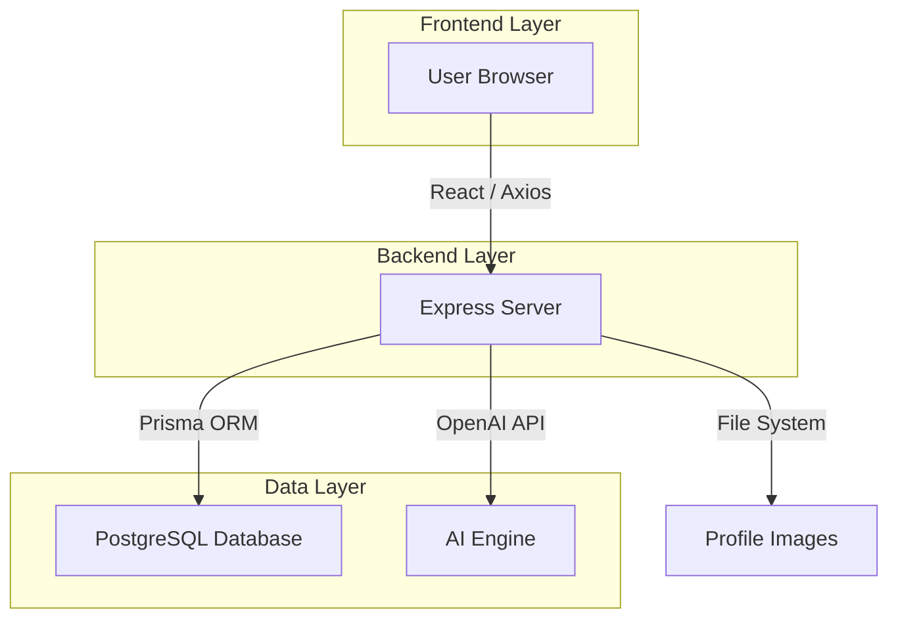

# Evangadi Forum: Next Generation 🚀

[](#)
[](https://opensource.org/licenses/MIT)
[](#)

A high-performance, community-driven Q&A platform built with **React**, **PostgreSQL**, and **Prisma**. Featuring a modern glassmorphic UI, AI-powered summaries, and a gamified reputation system.

---

## ✨ Key Features

### 🏛️ Modern Architecture
- **PostgreSQL (Neon)**: Relational data integrity with cloud-native scalability.
- **Prisma ORM**: Type-safe database queries and automated migrations.
- **Code Splitting**: Optimized performance with React lazy loading.

### 🎨 Premium UI/UX
- **Glassmorphism Design**: Sleek, modern interface with multi-theme support (Dark/Light).
- **Skeleton Loaders**: Smooth, flickering-free content transitions.
- **Responsive Layout**: Enterprise-grade experience on mobile, tablet, and desktop.

### 🧠 Intelligent Functionality
- **AI-Powered Summaries**: Instant insights for long discussions (OpenAI integration).
- **Gamified Reputation**: Badge-based reward tiers (Bronze, Silver, Gold).
- **Advanced Search**: Instant keyword and tag-based discovery.

---

## 🛠️ Tech Stack

### Frontend
- **React 18** (Vite-powered)
- **Axios** (API communication)
- **React-Toastify** (Dynamic alerts)
- **CSS Modules** (Scoped, clean styling)

### Backend
- **Node.js & Express**
- **Prisma ORM**
- **JWT** (Secure Authentication)
- **Multer** (Optimized file uploads)

---

## 🏗️ System Architecture



---

## 🚀 Getting Started

### Prerequisites
- Node.js (v16+)
- PostgreSQL (or Neon.tech account)

### Installation

1. **Clone the repo**
   ```bash
   git clone https://github.com/DesalegnTamirat/evangadi-forum.git
   cd evangadi-forum
   ```

2. **Backend Setup**
   ```bash
   cd server
   npm install
   # Create .env with DATABASE_URL, JWT_SECRET, and OPENAI_API_KEY
   npx prisma generate
   npm start
   ```

3. **Frontend Setup**
   ```bash
   cd client
   npm install
   npm run dev
   ```

---

## 📜 License
Distributed under the MIT License. See `LICENSE` for more information.

---

## 🤝 Contributing
Contributions are what make the open source community such an amazing place to learn, inspire, and create. Any contributions you make are **greatly appreciated**.

1. Fork the Project
2. Create your Feature Branch (`git checkout -b feature/AmazingFeature`)
3. Commit your Changes (`git commit -m 'Add some AmazingFeature'`)
4. Push to the Branch (`git push origin feature/AmazingFeature`)
5. Open a Pull Request
